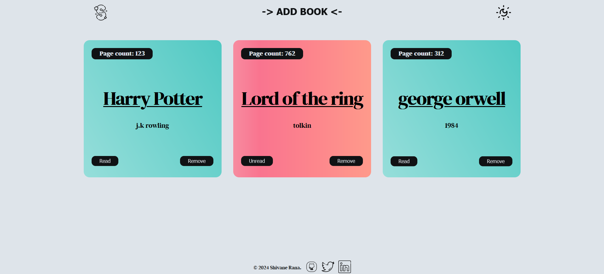
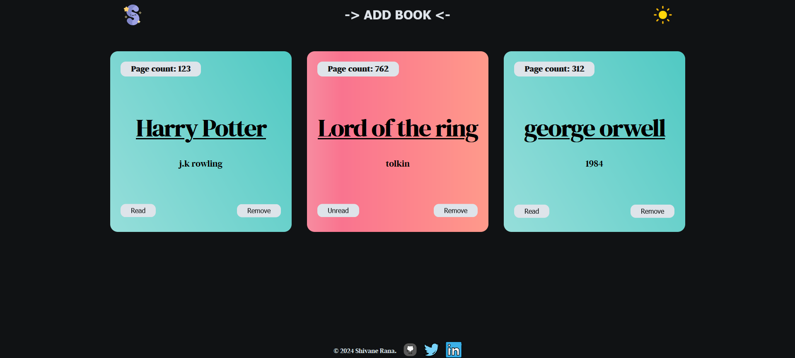

# Library System

This project is a web-based Library System that allows users to manage a collection of books. Users can add books with details like author, title, and page count, mark them as read/unread, and remove them from the collection. The system supports both light and dark themes.

## Live Preview~

https://shivanerana.github.io/Odin-library/

## Features

- **Add Books:** Users can input details for a book and add it to their library.
- **Mark as Read/Unread:** Toggle between read and unread states for each book.
- **Remove Books:** Delete a book from the library.
- **Theme Toggle:** Switch between light and dark themes with smooth transitions.
- **Responsive Design:** The layout adapts to different screen sizes for an optimal experience.

## Usage

1. Clone the repository.
2. Open `index.html` in your browser.
3. Use the `+Add Book` button to add books to your library.
4. Toggle the theme using the sun/moon icon.
5. Manage your books by marking them as read or removing them.

## Screenshots~

### Light Theme

### Dark Theme

